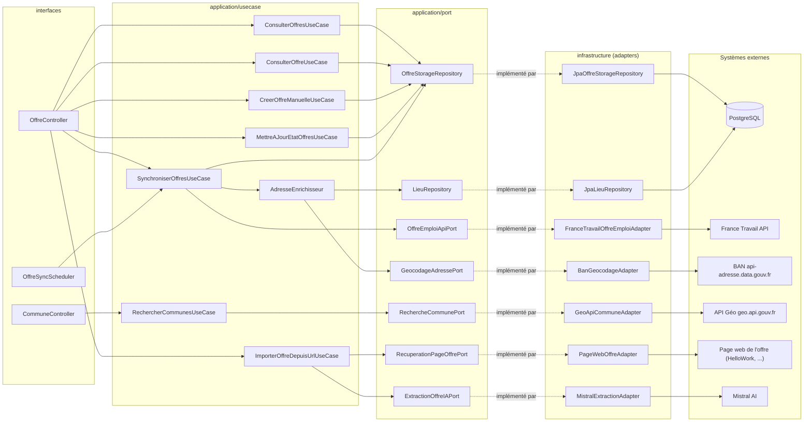
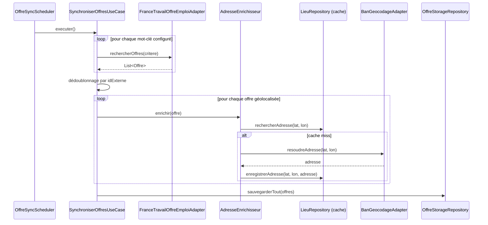
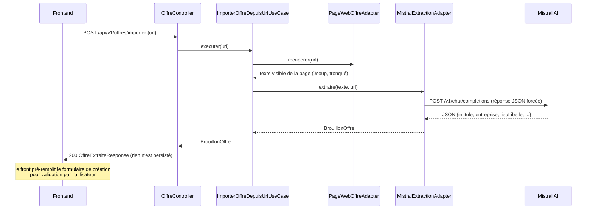

# Job Offres Tracker

Backend Spring Boot (4.1.0 / Java 25) qui :

- synchronise périodiquement des offres d'emploi depuis l'API **France Travail**, filtrées par mots-clés/type de contrat/commune ;
- enrichit chaque offre avec une adresse résolue par géocodage inverse (**API BAN**), avec un cache local en base ;
- permet de **créer une offre manuellement**, ou de l'**importer automatiquement depuis une URL** (ex. HelloWork) : la page est récupérée puis les champs (intitulé, entreprise, lieu, salaire, référence, date de publication...) sont extraits par une IA (**Mistral**) — l'offre n'est jamais enregistrée directement, les champs extraits sont renvoyés pour être vérifiés/corrigés côté front avant validation ;
- expose une recherche de communes françaises par nom (**API Géo**) pour associer un code INSEE fiable au lieu d'une offre ;
- expose une API REST paginée pour consulter/filtrer les offres et suivre leur état (non lu, lu, postulé, entretien...), consommée par le frontend `job-tracker-front`.

Ce document est destiné à un nouveau développeur qui découvre le projet : prérequis, configuration, lancement, et architecture.

## Sommaire

- [Prérequis](#prérequis)
- [Configuration](#configuration)
- [Lancement](#lancement)
- [Tests](#tests)
- [Architecture](#architecture)
- [Schémas](#schémas)
- [Base de données](#base-de-données)

## Prérequis

| Outil | Version | Remarque |
|---|---|---|
| JDK | 25 | le wrapper Maven (`mvnw`/`mvnw.cmd`) gère Maven lui-même |
| Docker | — | pour lancer PostgreSQL + pgAdmin en local via `docker-compose.yml` (sinon fournir un Postgres existant) |

Comptes/clés d'API externes nécessaires :

| Service | Nécessaire pour | Où l'obtenir | Clé requise ? |
|---|---|---|---|
| **France Travail** (`api.francetravail.io`) | Synchronisation planifiée des offres | Créer une application sur [francetravail.io](https://francetravail.io), y ajouter l'API **« Offres d'emploi v2 »** | Oui — `client_id` / `client_secret` |
| **Mistral AI** | Extraction des champs lors de l'import d'une offre par URL | [console.mistral.ai](https://console.mistral.ai) | Oui — clé API |
| **BAN** (`api-adresse.data.gouv.fr`) | Géocodage inverse (résolution d'adresse) | API publique de l'État | Non |
| **API Géo** (`geo.api.gouv.fr`) | Recherche de communes par nom | API publique de l'État | Non |

## Configuration

Rien n'est codé en dur : tout est piloté par `src/main/resources/application.yml`, surchargeable par variables d'environnement (`${VAR:valeur_par_défaut}`) ou par profil Spring.
 
Toutes les valeurs sensibles (clés d'API, mots de passe) sont centralisées dans un fichier `.env` à la racine du projet — **jamais commité** (`.gitignore`), et **jamais codé en dur** ni dans `docker-compose.yml` ni dans `application.yml`. `docker-compose` le charge automatiquement (support natif du fichier `.env` dans le répertoire du projet) ; pour l'application Spring lancée en dehors de Docker, il faut le charger explicitement dans la session (voir [Lancement](#lancement)).


Première installation : copier `.env.example` vers `.env` et compléter les valeurs.

| Variable | Obligatoire | Défaut si absente | Description |
|---|---|---|---|
| `FRANCETRAVAIL_CLIENT_ID` | Oui (pour la synchro) | `placeholder` (échoue à l'appel) | Identifiant client France Travail |
| `FRANCETRAVAIL_CLIENT_SECRET` | Oui (pour la synchro) | `placeholder` | Secret client France Travail |
| `MISTRAL_API_KEY` | Oui (pour l'import IA) | `placeholder` | Clé API Mistral |
| `DB_PASSWORD` | Non | `jobtracker` | Mot de passe PostgreSQL — même variable utilisée par l'application **et** par `docker-compose.yml` (conteneur `postgres`), donc toujours synchronisée |
| `PGADMIN_DEFAULT_EMAIL` | Non | `admin@admin.com` | Identifiant de connexion à pgAdmin (`docker-compose.yml` uniquement) |
| `PGADMIN_DEFAULT_PASSWORD` | Non | `admin` | Mot de passe de connexion à pgAdmin (`docker-compose.yml` uniquement) |

Autres points de configuration notables dans `application.yml` (tous surchargeables) :

- `jobtracker.sync.cron` : fréquence de la synchronisation planifiée (par défaut toutes les 6h)
- `jobtracker.recherche.mots-cles` / `type-contrat` / `code-commune` : critères de recherche France Travail
- `jobtracker.cors.allowed-origins` : origines autorisées pour le front (par défaut `http://localhost:5173`)
- `mistral.api.model` : modèle Mistral utilisé pour l'extraction (par défaut `mistral-small-latest`)
- `*.connect-timeout` / `*.read-timeout` : timeouts HTTP par intégration externe (France Travail, BAN, API Géo, scraping, Mistral)

## Lancement

```powershell
# 0. Une seule fois : créer le fichier de secrets local à partir du template, puis le compléter
Copy-Item .env.example .env
notepad .env

# 1. Démarrer PostgreSQL (+ pgAdmin sur http://localhost:5050)
# docker-compose lit automatiquement .env : POSTGRES_PASSWORD / PGADMIN_DEFAULT_* en sont issus
docker-compose up -d

# 2. Charger .env dans la session PowerShell courante (nécessaire uniquement hors Docker,
# Spring Boot ne lit pas .env lui-même)
Get-Content .env | ForEach-Object {
    if ($_ -match '^\s*([^#=]+)=(.+)$') {
        Set-Item -Path "env:$($matches[1].Trim())" -Value $matches[2].Trim()
    }
}

# 3. Démarrer le back-end (les migrations Flyway s'appliquent automatiquement au démarrage)
.\mvnw spring-boot:run
```

L'application écoute sur `http://localhost:8081` (pas de context-path). La documentation interactive de l'API est disponible sur **Swagger UI** : http://localhost:8081/swagger-ui.html (JSON brut sur `/v3/api-docs`).

## Tests

```powershell
.\mvnw test

# Une seule classe / une seule méthode
.\mvnw test -Dtest=ConsulterOffreUseCaseTest
.\mvnw test -Dtest=ConsulterOffreUseCaseTest#retourne_l_offre_correspondant_a_l_id_externe
```

## Architecture

Architecture **hexagonale (Ports & Adapters)**, imposée par la structure de package (mêmes conventions que le projet `sirene-backend`) :

```
fr.sirene.jobtracker
├── domain/
│   ├── model/         Offre, EtatOffre, Lieu, CritereRecherche, ResultatPagine<T>,
│   │                  Commune, BrouillonOffre
│   └── exception/     OffreEmploiApiException, RechercheCommuneException, ExtractionOffreIAException,
│                      RecuperationPageException, OffreNonTrouveeException, OffreDejaExistanteException
├── application/
│   ├── usecase/       ConsulterOffresUseCase, ConsulterOffreUseCase, CreerOffreManuelleUseCase,
│   │                  MettreAJourEtatOffresUseCase, SynchroniserOffresUseCase, AdresseEnrichisseur,
│   │                  RechercherCommunesUseCase, ImporterOffreDepuisUrlUseCase
│   └── port/          OffreStorageRepository, OffreEmploiApiPort, GeocodageAdressePort, LieuRepository,
│                      RechercheCommunePort, RecuperationPageOffrePort, ExtractionOffreIAPort
├── infrastructure/
│   ├── francetravail/  client/ (auth + recherche), mapper/, dto/*FranceTravail, config/,
│   │                   FranceTravailOffreEmploiAdapter (implémente OffreEmploiApiPort)
│   ├── ban/            client/, dto/*Ban, config/, BanGeocodageAdapter (implémente GeocodageAdressePort)
│   ├── geo/            client/, dto/, config/, GeoApiCommuneAdapter (implémente RechercheCommunePort)
│   ├── scraping/       client/ (fetch HTTP générique + extraction texte via Jsoup), config/,
│   │                   PageWebOffreAdapter (implémente RecuperationPageOffrePort)
│   ├── mistral/        client/, dto/, config/, MistralExtractionAdapter (implémente ExtractionOffreIAPort)
│   ├── persistence/    entités JPA, JpaOffreStorageRepository, JpaLieuRepository
│   └── config/         CorsConfig/CorsProperties, OpenApiConfig — cross-cutting, pas propriété d'un seul adapter
└── interfaces/
    ├── rest/           OffreController, CommuneController, GlobalExceptionHandler, dto/ (*Request/*Response)
    └── scheduler/       OffreSyncScheduler
```

### Flux principaux

- **Synchronisation planifiée** (`jobtracker.sync.cron`) : `OffreSyncScheduler` → `SynchroniserOffresUseCase` → pour chaque mot-clé, `OffreEmploiApiPort` (→ `FranceTravailOffreEmploiAdapter`, pagination via en-tête `Content-Range`, token géré/renouvelé par `FranceTravailAuthClient`) → dédoublonnage par `idExterne` → chaque offre géolocalisée est enrichie via `AdresseEnrichisseur` (cache `LieuRepository` d'abord, sinon `GeocodageAdressePort`/BAN puis mise en cache) → persistée via `OffreStorageRepository.sauvegarderTout` (upsert par `idExterne`, l'`etat` existant est préservé).
- **Création manuelle** (`POST /api/v1/offres`) : `CreerOffreManuelleUseCase`, `idExterne` généré (préfixe `MANUEL-`) si absent, 409 si collision.
- **Import assisté par IA** (`POST /api/v1/offres/importer`) : `ImporterOffreDepuisUrlUseCase` → `RecuperationPageOffrePort` (télécharge la page, extrait le texte visible via Jsoup, tronqué) → `ExtractionOffreIAPort` (prompt structuré envoyé à Mistral, réponse JSON forcée) → retourne un `BrouillonOffre` **sans rien persister** ; à charge du front de pré-remplir le formulaire de création pour validation par l'utilisateur.
- **Recherche de communes** (`GET /api/v1/communes?q=...`) : `RechercherCommunesUseCase` → `RechercheCommunePort` → `GeoApiCommuneAdapter` (API Géo), utilisé par le front pour associer un code INSEE fiable au lieu d'une offre.

## Schémas

### Ports et adapters

Chaque port (`application/port`) est une interface implémentée par exactement un adapter (`infrastructure/*`), qui parle à un système externe :



### Séquence : synchronisation planifiée



### Séquence : import d'une offre par IA



## Base de données

Migrations Flyway dans `src/main/resources/db/migration/V{n}__description.sql` (actuellement jusqu'à V5). `spring.jpa.hibernate.ddl-auto` est en `validate` : toute évolution de schéma passe par une nouvelle migration, jamais par les seules annotations d'entité.
